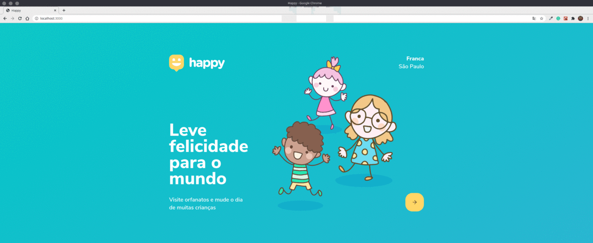
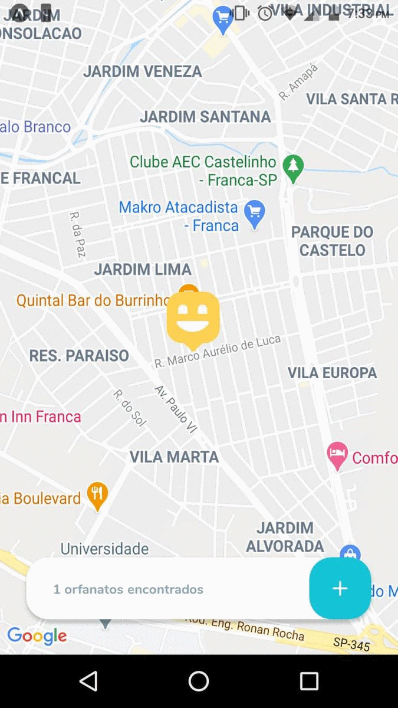

<h1 align="center">
  Next Level Week 3 (Happy)
</h1>

<p align="center">
  <a href="#rocket-projeto">Projeto</a>&nbsp;&nbsp;&nbsp;|&nbsp;&nbsp;&nbsp;
  <a href="#computer-tecnologias">Tecnologias</a>&nbsp;&nbsp;&nbsp;|&nbsp;&nbsp;&nbsp;
  <a href="#thinking-como-utilizar">Como utilizar</a>&nbsp;&nbsp;&nbsp;|&nbsp;&nbsp;&nbsp;
  <a href="#memo-licença">Licença</a>
</p>

## :rocket: Projeto

:globe_with_meridians: Projeto resultado da Next Level Week 3 (Happy)

## Preview

### Web

<p align="center">
    
</p>

### Mobile

<p align="center">
    
</p>

## :computer: Tecnologias

- [Node.js](https://nodejs.org/en/)
- [React.js](https://pt-br.reactjs.org/)
- [React Native](https://facebook.github.io/react-native/)

## :thinking: Como utilizar

### Backend

```sh
cd backend

yarn

yarn typeorm migration:run

yarn start
```

### Frontend

```sh
cd frontend

yarn

yarn start
```

### Mobile

```sh
cd mobile

yarn

yarn start
```

## :memo: Licença

Esse projeto está sob a licença MIT. Veja o arquivo [LICENSE](LICENSE) para mais detalhes.
